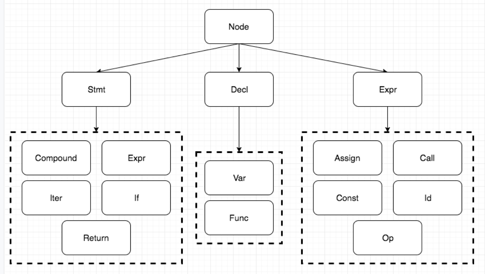
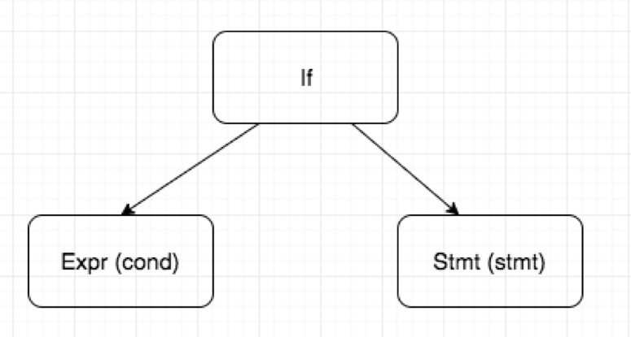
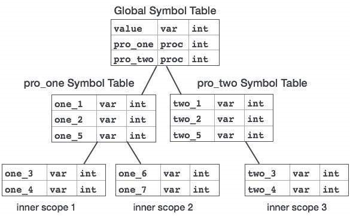
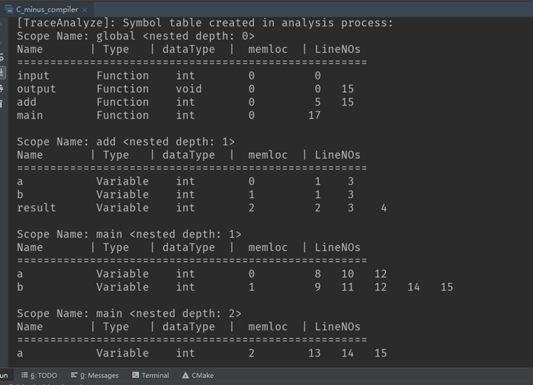
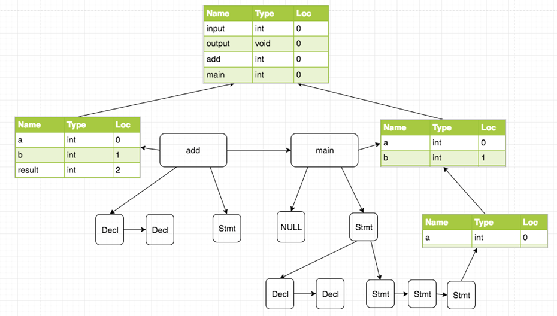
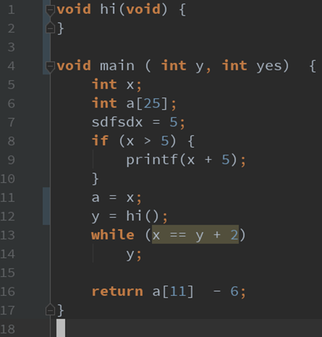
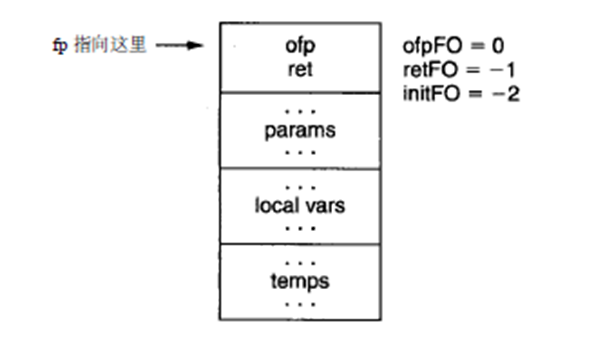
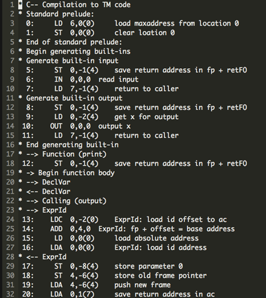

[TOC]

# 序言

本次课程设计中，本小组实现的是一个基于课程教材附录定义C-minus语言语法的编译器。本C-minus编译器包含了词法分析、语法分析、语义分析、代码生成、代码优化、运行环境等阶段和环节，支持从源代码从分析、生成目标代码以及最终运行的全过程。

在编译器开发过程之中，小组成员使用了Flex/Bison作为词法/语法分析工具，Git作为版本控制系统，分工明确，协作顺利。


## 文件说明


## 小组分工

袁林：symbol table, type checking, target code

林治轩：scanner, parser, target code

庄稼捷：intermediate code, target code


# 词法分析

## 原理简介

词法分析就是要将字符流转换成token流。基本的流程就是逐字符处理，一旦有符合定义的token，则输出那个token。当然，实际上有更复杂的规则，例如最长匹配等。

识别token的核心是有限状态机和正则表达式。正则表达式表达了一个token的字符组成，而有限状态机则实现了识别这个token的算法。例如以下一个简单的正则表达式：

```
letter(letter|digit)*
```

可以用以下的有限状态机来识别：


其中，0是开始状态，2是接受状态。在一个状态下读到某个字符，若这个字符对应某个transition的字符，则进行状态转移。

lex自动为我们实现了正则表达式到状态机的变化，所以我们只需要规定正则表达式即可。


## 正则表达式

C-minus的语法遵循了教材Appendix A.1的描述。总共有5类token：

1. 六个关键字：

   ```
   else if int return void while
   ```

2. 符号：

   ```
   + - * / < <= > >= == != = ; , ( ) [ ] { } /* */
   ```

3. 其他token，主要是`ID`和`NUM`。由以下正则表达式定义：

   ```
   ID = letter letter*
   NUM = digit digit*
   letter = [a-zA-Z]
   digit = [0-9]
   ```

4. 空白符包括空格，换行和制表符。这些token会被程序忽略。
5. C-style注释，即`/* */`

## token定义

首先我们定义在parser所需要用到的token：

```
%token '=' ';' ',' '(' ')' '[' ']' '{' '}'
%token ELSE IF RETURN WHILE
%token <type> INT VOID
%token <op> '+' '-' '*' '/' '<' '>' LE GE EQ NE
%token <id> ID
%token <intval> NUM
```

此外，还需要定义`yylval`的可能类型：

```
%union{
	class Node * node;
	int intval;
	char * id;
	OpKind op;
	TypeKind type;
}
```

其中类型和操作符会在`yylval`中返回对应的符号常量，而`ID`和`NUM` token会返回对应的字符串和数值。

## lex实现

C-minus的lex实现比较简单。对于大多数token，只要看到对应的词，返回对应的token即可。例如：

```
"else"      { return ELSE; }

"int"       { yylval.type = Int; return INT; }
"while"		{ return WHILE;}
"+"         { yylval.op = Plus; return '+';}
"-"         { yylval.op = Minus; return '-';}
```

对于`ID`和`NUM`，需要返回对应的字符串和数值：

```
{id}    {
	char * text = new char[BUFSIZE];
	strcpy(text, yytext);
	yylval.id = text;
	return ID;
}
{num}   { yylval.intval = atoi(yytext); return NUM; }
```

注释的处理参考了常见的C-style注释的处理方法：

```
"/*"            { BEGIN(C_COMMENT); }
<C_COMMENT>"*/" { BEGIN(INITIAL); }
<C_COMMENT>.    { }
<C_COMMENT>\n   { }
```

# 语法分析

## 原理简介

任何语言的文法一般都使用BNF来描述。BNF中我们使用的nonterminal即lex输出的token。例如，简单表达式的BNF可以是：

```
1    E -> E + E
2    E -> E * E
3    E -> id
```

BNF生成表达式的过程可以用一系列的derivation来得到：

```
E -> E * E             (r2)
  -> E * z             (r3) 
  -> E + E * z         (r1)
  -> E + y * z         (r3)
  -> x + y * z         (r3)
```

这里只介绍yacc使用的bottom-up parsing。bottom-up parsing从token流开始，逐步恢复生成他们的nonterminals，即生成的相反过程。例如：

 ```
 1   . x + y * z     shift
 2   x . + y * z     reduce(r3)
 3   E . + y * z     shift
 4   E + . y * z     shift
 5   E + y . * z     reduce(r3)
 6   E + E . * z     shift
 7   E + E * . z     shift
 8   E + E * z .     reduce(r3)
 9   E + E * E .     reduce(r2)   emit multiply
10   E + E .         reduce(r1)   emit add
11   E .             accept
 ```

这里有两个主要的动作：

* shift：入栈
* reduce：将栈顶的一组symbol变成对应的nonterminal

何时进行这两个动作，以及如何解决冲突，就是各种bottom-up parsing算法的区别。yacc使用的是LALR(1)算法。这里就不详细说明了。

## 文法描述

我们遵循教材Appendix A.2中描述C-minus的文法。完整文法如下：


该文法是于C语言文法兼容。整个程序就是函数和变量声明的list，支持，函数，循环，分支，递归，运算表达式登常见语言要素。

除此之外，C-minus还支持两个预定义的函数`input`和`output`：

```
int input(void) {...}
void output(int x) {...}
```

## 语法树设计

### 概览

语法树的设计是语法分析乃至整个编译器设计的核心。下面我们介绍整个语法树设计的核心：

* 语法树由许多节点(Node)连接构成
* Node按照表达的语法成分不同，有许多类型
* Node的类型具有层次关系，用C++的继承实现
* Node之间有两种关系：
  * parent-children关系：用来表达"包含"关系
  * next关系：用来表达"并列”关系，例如声明列表，参数列表等
* 每个Node除了这类连接之外，还可能有独属于这个Node的attribute

### 数据结构

数据结构的核心是定义各种Node。Node的类型继承树如下：



所有Node继承自`Node`类：

```c++
class Node {
public:
	// data members
	NodeType nodetype;
	union {
		DeclType decl;
		StmtType stmt;
		ExprType expr;
	} subtype;

	// necessary since some rules will return a list
	Node * next = nullptr;
	vector<Node *> children;
	int lineno;
	Scope scope = nullptr;

	// methods
	Node(NodeType type);
	void add_child(Node * node) {
		children.push_back(node);
	}

	virtual string str();
};
```

各种field的含义如下：

* `nodetype`： Node的类型
* `next`：若这个Node是某个list的一部分，`next`指向下一个Node
* `children`：子节点列表。

`Stmt`，`Decl`， `Expr`Node继承自`Node`类：

```c++
class DeclNode : public Node {
public:
   DeclNode(DeclType type) : Node(Decl) {
      subtype.decl = type;
   }
};

class StmtNode : public Node {
public:
   StmtNode(StmtType type) : Node(Stmt) {
      subtype.stmt = type;
   }
};

class ExprNode : public Node {
public:
   TypeKind kind; // expression has kind which assigned in analysis
   ExprNode(ExprType type) : Node(Expr) {
      subtype.expr = type;
   }
};
```

接下来的每种Node都对应一个语法结构。由于类型较多，这里举两个例子，其他的Node可以参照代码。

if节点的树结构十分简单，如下：



对应的定义：

```c++
class IfStmtNode : public StmtNode {
public:
	/*
	* Two nodes:
	* - cond: ExprNode
	* - stmt: StmtNode
	*/
	bool has_else = false;
	IfStmtNode(Node * cond, Node * stmt, bool has_else = false, Node * else_stmt = nullptr) : StmtNode(If) {
		this->add_child(cond);
		this->add_child(stmt);
		if (else_stmt != nullptr) {
			this->add_child(else_stmt);
		}
	}

	virtual string str();
};
```

很自然的，构建时需要传入至少两个Node，即条件表达式和语句。

Compound语句的树结构是另一种典型。这体现了链表是如何集成于语法树中的：


对应的定义：

```c++
class CompoundStmtNode : public StmtNode {
public:
   /*
   * Two nodes:
   * - decl: a list of DeclNode
   * - stmt: a list of StmtNode
   */
   CompoundStmtNode(Node * decl, Node * stmt) : StmtNode(Compound) {
      this->add_child(decl);
      this->add_child(stmt);
   }

   virtual string str();
};
```

可见，在构建时，我们需要传入两个链表。一个是本地声明列表，另一个是语句列表。

以下是所有Node的结构定义：

**两种`Decl`节点**：


**三种`Stmt`节点**：(除了上面已经提到过的两种)


**五种`Expr`节点：**


### 示例

以下是一个简单的C-minus程序：


其对应的语法树(前三层)为：


我们按照缩进，对完整语法树做了一个简单的可视化：

```
Func: int add
  Decl: int a
  Decl: int b
  Block
    Decl: int result
    Expr
      Assign
        Id: result
        Op: +
          Id: a
          Id: b
    Return
      Id: result
Func: int main
  Block
    Decl: int a
    Decl: int b
    Expr
      Assign
        Id: a
        Const: 1
    Expr
      Assign
        Id: b
        Const: 2
    If
      Op: <
        Id: a
        Id: b
      Block
        Decl: int a
        Expr
          Assign
            Id: a
            Op: +
              Id: b
              Const: 1
        Expr
          Call: output
            Call: add
              Id: a
              Id: b
```

# 语义分析

## 原理简介

语义分析(semantic analysis)的任务是计算编译过程所需的附加信息。因为编译器完成的分析是静态(在执行之前发生)定义的，语义分析也可以称为静态语义分析(static semantic analysis)。

一般的，语义分析包括了构造符号表、记录声明中建立的名字的含义、在表达式和与剧中进行类型推断和类型检查以及在语言的类型规则作用域内判断它们的正确性。

在C--语言的语义分析中，主要包括了符号表的建立和类型检查两部分，类型检查可以检测出大部分错误类型并作出相应的error report。

## 符号表设计

### 概览

语义分析中最重要的部分是符号表(symbol table)，符号表中维护了所有在程序段中定义的符号信息，包括了符号名、类型、内存虚拟地址、所在行号等信息。同时，在C--中，需要通过特殊的组织结构将作用域信息与符号表设计结合。

在做类型检查的过程之中，需要查找符号表，并将计算出的类型属性更新到符号表之中。在生成目标代码的过程之中，变量内存空间的分配需要通过查表得到其内存虚拟地址来计算。在整个编译流程中，符号表的作用都是不可替代的。

符号表的基本数据结构是hash table，实现细节如下：

- separate chaining
- hash function: $h_0 = 0$，$h_{i-1} = \alpha h_i - c_i$，其中$c_i$为symbol name字符串第i个字符的数字值

### 数据结构

在C--中，由于变量有着作用域的限制，符号表的设计也需要做出相应的调整。如下图所示，随着嵌套定义的作用域scope，多个symbol table构成了一个树状的拓扑结构：



首先，需要定义symbol table的一个索引项BucketListRec类：

```c++
class BucketListRec {
public:
	// data members
	string id;
	vector<int> lines;
	Node *node;
	int memloc;
	BucketListRec *next;

	// methods
	BucketListRec(string _id, Node *_node, int _memloc) {
		id = _id; node = _node; memloc = _memloc;
	};
};
typedef vector<BucketListRec> BucketList;
```

各个field的含义如下：

- `id`: symbol name，对于变量而言是变量名，对于函数而言是函数名；
- `lines`: 行号，记录了该变量出现的所有所在行的位置信息；
- `node`：指向syntax tree结点的指针，对于每个symbol都指向了其varDeclNode，便于之后的操作和修改；
- `memloc`：内存地址，在符号表内对当前scope所有的符号分配了虚拟的内存地址，便于生成目标代码时分配内存空间；
- `next`：在separate chaining中用于存储发生collision时的下一个BucketListRec；

定义`vector<BucketListRec>`为`BucketList`类型，代表了symbol table中同一hash value的list。

由于每一张符号表需要和一个作用域Scope相绑定，定义类scope如下：

```c++
/* The record of scope, maintaining one symbol table each */
class ScopeRec {
public:
	// data members
	string scopeName;
	int nestedLevel;
	ScopeRec *parentScope;
	/* symbol table of this scope*/
	BucketList hashTable[HASH_TABLE_SIZE];

	// methods
	ScopeRec(string _scopeName) { scopeName = _scopeName; };
};
typedef ScopeRec* Scope;
```

其中各个field的含义如下：

- `scopeName`：作用域名称，一般为所在函数名称；
- `nestedLevel`：嵌套的层数，如main函数内为第一层，main之内的compound语句为第二层；
- `parentScope`：指向其父scope的指针，用于在搜索时向上搜索最近的symbol；
- `hashTable`：该scope对应的符号表

### 示例

同样以语法树中的样例程序为例：


可以将其对应的符号表打印如下：



下图可以表现对应的语法树和符号表结构关系：



在已有的语法树结构之外，每个自带scope的结点(即所有的FunDeclNode和CompoundNode)会有一个指向scope结构的指针，对应了其所在作用域的符号表；

scope之间由于存在嵌套关系，因此每个scope会有指向其父作用域的指针，如上图所示，当在一个符号表中lookup某个变量名而没有找到时，会根据就近原则查找其父符号表。


## 类型检查

### 概览

除了建立符号表外，语义分析的另一个重要任务是对程序中的类型属性进行类型检查(type checking)。类型(type)可以看作是符号的一个属性(attribute)，类型检查的过程也是属性计算(attribute calculation)的过程。

在建立符号表时，我们的方法是对语法树进行前序遍历(pre-order traversal)，这是因为需要在作为scope结点的根节点先确立该scope的符号表，才能向符号表中插入这个scope下的符号信息；而在做类型检查的时候，需要对语法树进行后序遍历(post-order traversal)，计算出子节点的类型后才好进行类型检查，如果类型上出现错误，需要打印适当的报错信息。


### 错误类型

错误类型基本包含了所有C--程序能在语义分析阶段检测出的错误，如：

- Array without index used as left value
- Function call inconsistent with declaration
- Wrong type of return value of a function
- Any wrong type in assignment statements
- ...


### 示例

以下为一个包含了较多类型错误的代码段在type checking后的反馈结果：




从上面的结果可以看出，type checking可以检查出上面定义的错误类型，并给程序编写者准确无误的反馈结果。


# 中间代码生成

## 原理简介

程序通过遍历语法树，访问各个语句节点，按照一定规则逐个翻译成中间代码。

由前，所有的语句可分为三类，同时每类可以细分为几个小类别：

- Stmt : ExprStmt/IfStmt/IterStmt/ReturnStmt/CompoundStmt
- Expr : AssignExpr/CallExpr/OpExpr/ConstExpr/IdExpr
- Decl : VarDecl/FunDecl

接下来，逐个介绍其三地址码转化形式


## Stmt语句

### ExprStmt

直接转化为Expr，调用Expr的生成函数即可，后面会做详细介绍


### IfStmt

采用If_false跳转指令，计算跳转条件之后，若为false(即为0)，跳转至else部分或语句结尾，反之则顺序执行，执行完语句块之后跳转至语句结尾。

```
if(x > 0) {
    x = x + 1;    
} else {        
    x = x - 1;    
}
```

```
    /* calculate jump condition */
    If_false t0 GOTO L0;
    /*stmt block 1*/
    GOTO L1;
L0:
    /*stmt block 2*/
L1:
```


### IterStmt

采用If_false跳转指令，计算跳转条件，若为false则跳转至语句尾，反之，顺序执行，执行完语句块中内容后，重新跳转至计算跳转条件的部分。

```
while(x < 10) {
    x = x + 1;
}
```

```
L0:
    /*calculate jump condition*/
    If_false t0 GOTO L1;
    /*stmt block*/
L1:
```


### ReturnStmt

加载到寄存器之后直接返回：

```
retrun x;
```

```
t0 = x;
return t0;
```


### CompoundStmt

此为一系列Stmt语句的组合，即{ }中所包括的所有语句，在这里不做处理。


## Expr语句

### AssignExpr

赋值语句，对元素进行赋值，如下：

```
int x;
x = 3;
```

```
t0 = 3;
x = t0;
```


### CallExpr

调用函数，先计算出所需要的每一个参数值，并压入，完成之后调用函数，最后弹出所有压入的参数。如下：

```
int acc(int x) {
    x = x + 1;
    return x;
}

int main(void) {
    acc(0);
    return 0;
}
```

```
main :	
    BeginFunc;	
    t0 = 0;	
    PushParam t0;	
    LCall acc;	
    PopParams 4;	
    EndFunc;
```


### OpExpr

形如`A = B op C`，计算出B和C的值，然后存储在寄存器中，进行运算，最后赋值给A：

```
x = 3;
y = 4;
x = x + y;
```

```
t0 = x;
t1 = t0;
t0 = y;
t2 = t0;
t0 = t1 + t2;
x = t0;
```


### ConstExpr

在生成时，会将所有常量都存储到寄存器中进行计算：

```
x = 3;
```

```
t0 = 3;
x = t0;
```


### IdExp

在运算时，会将变量的值先存到寄存器中：

```
x = x + 1;
```

```
t0 = x;
t1 = t0;
t0 = 1;
t2 = t0;
t0 = t1 + t2;
x = t0;

```


## Decl语句

### VarDecl

在中间代码生成处，变量定义不做处理。


### FunDecl

首行为函数名，由BeginFunc作为开头，以EndFunc作为结尾，中间部分和普通语句相同。

```
int acc(int x) {
    x = x + 1;
    return x;
}
```

```
acc :	
    BeginFunc;	
    t0 = x;	
    t1 = t0;
    t0 = 1;	
    t2 = t0;	
    t0 = t1 + t2;	
    x = t0;	
    t0 = x;	
    Return t0;	
    EndFunc;
```


## 数组

访问数组元素变量，找到基地址，算出偏移量，乘以元素大小，相加得到存储地址，之后进行相应的赋值操作：

```
int a[10];
a[0] = 1;
```

```
t0 = 2;
t1 = t0 * elem_size(a);
t2 = &a + t1;
t0 = 1;
*t2 = t0;
```


# 目标代码生成

## 原理简介

相比于中间代码生成，目标代码(target code)生成的是如x86、MIPS这样能在实际机器上运行的目标机器汇编代码。其中涉及到比中间代码更多的细节，诸如：寄存器分配、运行环境的考量、内存空间的分配、运行时栈的结构等等。

在目标代码生成部分，我们小组选用的是课程教材上提供的TINY语言的目标代码。由于课后附录部分提供了TINY语言的一个virtual machine，生成的目标代码可以在tiny machine上实际运行。

本小节后续将会介绍Tiny目标代码的文法、寄存器设定，C-minus语言使用的运行时环境，具体实现中的接口定义，各个结点类型对应的目标代码。


## 目标代码文法与运行时环境

### TINY目标代码

TINY语言的目标代码完全指令集如下图所示：


对于对汇编语言有一定经验的人，显然这个指令集并不难理解，其可以看作是一个完整指令集的简化版本，但仍然有着完备的计算功能。下面是这个目标代码指令集的一些细节：

- 7条RO指令(register-register)
- 10条RM指令(register-memory)
- 8个寄存器，包含了以下专用寄存器：
  - reg[0] - ac, reg[1] - ac1, 用作数值计算时的累加器
  - reg[4] - fp，帧指针(frame pointer)
  - reg[5] - gp，全局指针(global pointer)
  - reg[6] - mp，内存指针(memory pointer)
  - reg[7] - pc，程序计数器(program counter)
- 包括了built-in的I/O指令(IN/OUT)


### TINY Machine运行时环境

因为C-minus支持函数调用和返回，那么一个基于栈结构的runtime envrionment也是必不可少的，下图显示了C-minus中的帧结构/活动记录：



这里fp是当前结构指针(current frame pointer)，为便于访问保存在4号寄存器中。ofp(旧结构指针)是课程中讨论过的控制链(control link)。FO右端的0、-1、-2是每个存储值的偏移量。参数、局部变量等都已经在当前活动记录绑定的符号表中分配了虚拟地址。

例如，若有一段C-minus函数的声明如下：

```c++
int f(int x, int y)
{
    int z;
    ...
}
```

则x，y，z必须在当前活动记录结构中分配，x、y和z的偏移量分别为-2、-3和-4。其中x与y是在params field，而z是在local vars field。


## 具体实现

### 数据结构

在生成目标代码的过程中，同时需要查询当前scope内的符号表信息，以分配当前活动记录内的内存空间，因此声明`fun`和`track`类如下：

```c++
class fun {
public:
    string fun_name;
    int index;
    fun(string fun_name, int index);
};

class track {
public:
    Scope current_scope;
    vector<fun> funs;
    void add_func(string id, int index);
    int find_func(string id);
};
```

在`track`中记录了遍历语法树时当前的作用域`current_scope`和函数记录`funs`，如需查找当前符号表中对某一个符号分配的内存空间，可直接使用符号表模块`symtab`中的`st_lookup(current_scope, id)` 函数获取其在符号表中的位置。


### 接口定义

在将目标代码写入目标代码文件`filename.tm`时，我们使用了教材附录中`code.c`中提供的函数接口，其能够在编写`gentiny`模块时为开发者提供方便的目标代码生成的接口调用。

`code.h`中的接口函数如下：

```c++
/* code emitting utilities */

/* Procedure emitComment prints a comment line 
 * with comment c in the code file
 */
void emitComment( const char * c );

/* Procedure emitRO emits a register-only
 * TM instruction
 * op = the opcode
 * r = target register
 * s = 1st source register
 * t = 2nd source register
 * c = a comment to be printed if TraceCode is TRUE
 */
void emitRO( const char *op, int r, int s, int t, const char *c);

/* Procedure emitRM emits a register-to-memory
 * TM instruction
 * op = the opcode
 * r = target register
 * d = the offset
 * s = the base register
 * c = a comment to be printed if TraceCode is TRUE
 */
void emitRM( const char * op, int r, int d, int s, const char *c);

/* Function emitSkip skips "howMany" code
 * locations for later backpatch. It also
 * returns the current code position
 */
int emitSkip(int howMany);

/* Procedure emitBackup backs up to 
 * loc = a previously skipped location
 */
void emitBackup(int loc);

/* Procedure emitRestore restores the current 
 * code position to the highest previously
 * unemitted position
 */
void emitRestore(void);

/* Procedure emitRM_Abs converts an absolute reference 
 * to a pc-relative reference when emitting a
 * register-to-memory TM instruction
 * op = the opcode
 * r = target register
 * a = the absolute location in memory
 * c = a comment to be printed if TraceCode is TRUE
 */
void emitRM_Abs(const char *op, int r, int a, const char * c);
```

以上函数对于写目标代码文件作用如下：

- `emitComment`：在tm文件中写入参数中的字符串作为注释内容；
- `emitRO`：在目标代码文件中写入RO类型的指令；
- `emitRM`：在目标代码文件中写入RM类型的指令；
- `emitSkip`：在目标代码文件中跳过参数指定数目的行数，可能用于之后的反填；常见用法如：emitSkip(1)跳过一个位置，通常之后填上转移指令；
  emitSkip(0)不跳过位置，但可以得到当前位置已备之后的转移指令引用；
- `emitBackup`：设置当前指令位置到先前的位置反填；
- `emitRestore`：返回当前指令位置给先前调用emitBackup的值；
- `emitRM_Abs`：将绝对地址转换为pc-relevant的转移指令；


gentiny.h中对于target code的函数声明如下：

```c++
void gentiny(Node * tree);
void gentiny_code(Node * tree, track & track);

// DeclType : Var, Fun
void gentiny_decl(DeclNode * tree, track & track);
void gentiny_decl_var(VarDeclNode * node, track & track);
void gentiny_decl_fun(FunDeclNode * node, track & track);

// ExprType : Assign, Call, Op, Const, Id
void gentiny_expr(ExprNode * tree, track & track, bool isAddress=false);
void gentiny_expr_assign(AssignExprNode * node, track & track);
void gentiny_expr_call(CallExprNode * node, track & track);
void gentiny_expr_op(OpExprNode * node, track & track);
void gentiny_expr_const(ConstExprNode * node, track & track);
void gentiny_expr_id(IdExprNode * node, track & track, bool isAddress);

// StmtType : ExprStmt, If, Iter, Return, Compound
void gentiny_stmt(StmtNode * tree, track & track);
void gentiny_stmt_expr(ExprStmtNode * node, track & track);
void gentiny_stmt_if(IfStmtNode * node, track & track);
void gentiny_stmt_iter(IterStmtNode * node, track & track);
void gentiny_stmt_return(ReturnStmtNode * node, track & track);
void gentiny_stmt_compound(CompoundStmtNode * node, track & track);
```

其中部分接口的作用如下：

- `gentiny(Node * tree)`：gentiny模块对外接口，完成一系列初始化工作并调用`gentiny_code` 实际生成目标代码并写入目标代码文件；
- `gentiny_code(Node * tree, track & track)`：生成目标代码的函数接口，根据结点类型选择调用相应类型对应的目标代码生成函数；
- `gentiny_decl/expr/stmt`：生成目标代码对于`NodeType `的接口函数，通过判断当前`Node`的`DeclType`/`ExprType`和`StmtType`调用实际真正产生目标代码的函数；
- 其余函数为具体的目标代码生成功能函数，如`gentiny_stmt_iter`函数生成`IterStmtNode`对应的目标代码；


### 不同语句对应实现

#### 基本原理

对一段语法树的结构，需要在该模块中实现相应的到目标代码的translation，并将目标代码写入目标代码文件。


#### 函数声明


#### 函数调用

核心代码段如下：

```c++
// frame offset is the current stack pointer
// compute arguments
int param_offset = 0;
for (Node * param = node->children[0]; param != nullptr; param = param->next) {
    // param is a exp node
    gentiny_code(param, track);
    // after this, result will be stored in ac. Store this
    sprintf(buffer, "store parameter %d", param_offset);
    emitRM("ST", ac, frame_offset + initFO - param_offset, fp, buffer);
    param_offset += 1;
}

// store old frame pointer
emitRM("ST", fp, frame_offset + ofpFO, fp, "store old frame pointer");
// push new frame
emitRM("LDA", fp, frame_offset, fp, "push new frame");
// save return in ac
emitRM("LDA", ac, 1, pc, "save return address in ac");
// jump. This uses the global address of the function
emitRM_Abs("LDA", pc, track.find_func(node->id), "jump to the function");

// after call done, pop current frame. At this point, fp is the new fp
emitRM("LD", fp, ofpFO, fp, "restore frame pointer");
```

在调用函数时，经历了以下几步目标代码的生成：

1. 计算arguments，并用ST指令将其写入活动记录中的params field；
2. 存储旧的帧指针、将新的帧指针压栈并存储return address；
3. 将pc改为函数声明所在位置，从而jump到函数起始位置；
4. 在执行完函数体中的语句之后，弹出栈当前frame；


### 示例

仍然以之前语法分析和语义分析中的代码为源代码。由于其生成的目标代码太长且不便于阅读，这里仅以部分生成的目标代码作为示例参考：




# 测试样例

在`demo`文件夹中，我们准备了一些测试样例，样例涵盖了：

- 所有基本语句测试
- 复杂语句
- 函数声明与调用
- 错误检查测试
- I/O操作测试
- 二分查找
- 快速排序

提供了三个测试样例`demo/qsort.c, demo/search.c, demo/error.c`，分别演示快排，二分搜索和错误处理。

### 快速排序

以下是快速排序的源代码：

```
void qsort(int a[], int start, int stop) {
	int key;
	int i;
	int j;
	int flag;
    /* test comment */
	int temp;

	i = start;
	j = stop;
	key = a[start];
	flag = 0;

	while(i < j) {
		if(flag == 0) {
			if(a[j] < key) {
				temp = a[j];
				a[j] = a[i];
				a[i] = temp;
				flag = 1;
			} else {
				j = j - 1;
			}
		} else {
			if(a[i] > key) {
				temp = a[j];
				a[j] = a[i];
				a[i] = temp;
				flag = 0;
			} else {
				i = i + 1;
			}
		}
	}

	if(start < stop) {
		qsort(a, start, i-1);
		qsort(a, i+1, stop);
	}

}


int main(void) {

	int a[10];
	int i;

	i = 0;

	while(i < 10) {
		a[i] = input();
		i = i + 1;
	}

	qsort(a, 0, 9);

	i = 0;

	while(i < 10) {
		output(a[i]);
		i = i + 1;
	}	

	return 0;
}

```


下面介绍一下`qsort.c`的测试方法：

1. 编译代码：`./cminus demo/qsort.c qsort.tm`

2. 运行虚拟机：`./tm qsort.tm`

3. 出现`Enter command:`后，输入`go`

4. 之后会出现十次`Enter value for IN instruction: `。我们任意输入10个数字。例如：

   ```
   Enter value for IN instruction: 3
   Enter value for IN instruction: 7
   Enter value for IN instruction: 2
   Enter value for IN instruction: 0
   Enter value for IN instruction: 5
   Enter value for IN instruction: 3
   Enter value for IN instruction: 2
   Enter value for IN instruction: 6
   Enter value for IN instruction: 7
   Enter value for IN instruction: 2
   ```

5. 完成后，程序会输出排序的结果：

   ```
   OUT instruction prints: 0
   OUT instruction prints: 2
   OUT instruction prints: 2
   OUT instruction prints: 2
   OUT instruction prints: 3
   OUT instruction prints: 3
   OUT instruction prints: 5
   OUT instruction prints: 6
   OUT instruction prints: 7
   OUT instruction prints: 7
   
   ```

### 二分搜索

源代码如下：

```C
int search(int a[], int len, int target) {

	int i;
	int j;
	int mid;
	int loop;
	int index;

	loop = 1;
	i = 0;
	j = len-1;
	mid = (i + j)/2;
	index = 1000;

	while(((loop == 1) * (i < j)) == 1) {
		if(a[mid] == target) {
			loop = 0;
			index = mid;
		} else {
			if(a[mid] > target) {
				j = mid;
				mid = (i + j) / 2;
			} else {
				i = mid + 1;
				mid = (i + j) / 2;
			}
		}
	}

	return index;

}

int main(void) {

	int a[1000];
	int i;
	int index;

	int x;
	int y;

    x = 10;
	i = 0;

	while(i < x) {
		a[i] = input();
		i = i + 1;
	}

	y = input();

	index = search(a, x, y);

	output(index);

	return 0;

}

```


下面介绍一下`search.c`的测试方法。这个程序执行二分查找。

1. 编译代码：`./cminus demo/search.c search.tm`

2. 运行虚拟机：`./tm search.tm`

3. 出现`Enter command:`后，输入`go`

4. 之后会出现十次`Enter value for IN instruction: `。我们**从小到大**输入10个数字。例如：

   ```
   Enter value for IN instruction: 1
   Enter value for IN instruction: 5
   Enter value for IN instruction: 7
   Enter value for IN instruction: 8
   Enter value for IN instruction: 10
   Enter value for IN instruction: 14
   Enter value for IN instruction: 46
   Enter value for IN instruction: 355
   Enter value for IN instruction: 677
   Enter value for IN instruction: 789
   ```

5. 第十一次，我们输入要查找的数字，例如：

   ```
   Enter value for IN instruction: 8
   ```

6. 此时程序就会输出`8`所在的索引位置，即3。如果没找到，会输出1000


### 错误处理

`demo/error.c`中的代码有诸多错误：

```C
void hi(int f){
    int val;
    {
        int x;
        if(f != 0){
            int x;
            x = x + 1;
        }
    }
    return val;
}


int add(int u, int v){
    int result;
    result = 0;
    result = u + v;

    return ;
}

int main ( int y, int yes)  {
    int x;
    int a[25];
    int b;

    a = 5;
    b[1] = 1;
    add(1);
    while(hi(x)){
        x = 2 * x;
    }
    x = a[hi(1)];

    x = hi(1) + 1;
    return a[11]  - 6;
}
```

要测试`demo/error.c`，运行`./cminus demo/error.c error.tm`即可。这个C程序有很多错误，编译器会将所有错误都报告：

```
Error in Line[10]: no return value expected
Error in Line[19]: Int return value expected
Error in Line[27]: assignment to an array variable
Error in Line[28]: index of a non-array variable is invalid
Error in Line[29]: the number of parameters is inconsistent with declaration
Error in Line[30]: invalid type in condition: Void
Error in Line[33]: the index of array should be Int type
Error in Line[35]: operand's type is invalid: void
```


