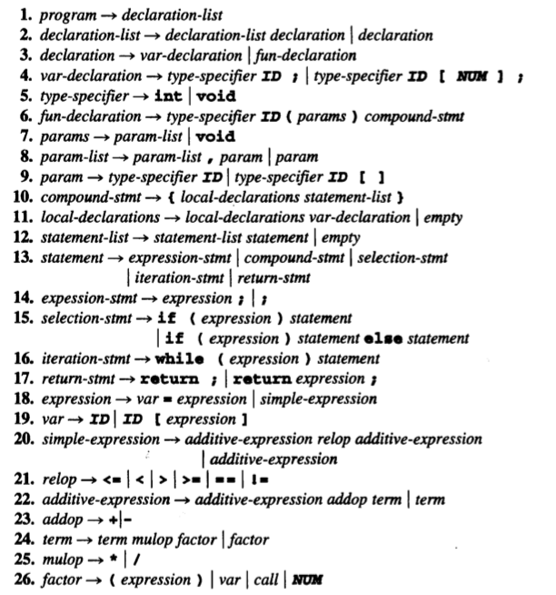
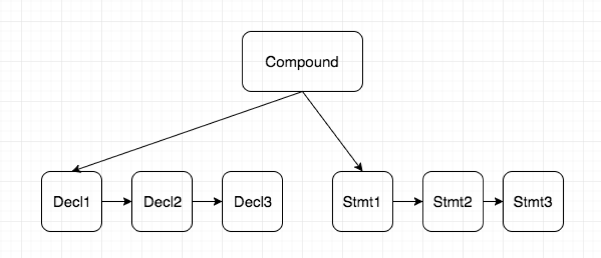
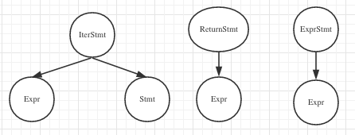
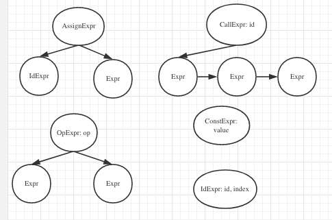
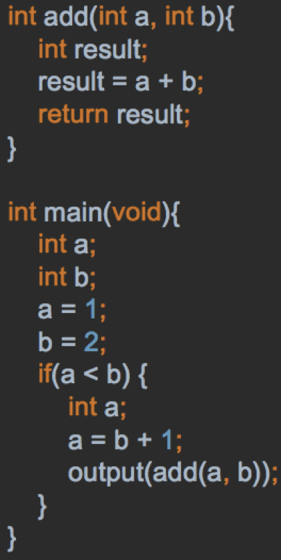

[TOC]

# 词法分析

## 原理简介

词法分析就是要将字符流转换成token流。基本的流程就是逐字符处理，一旦有符合定义的token，则输出那个token。当然，实际上有更复杂的规则，例如最长匹配等。

识别token的核心是有限状态机和正则表达式。正则表达式表达了一个token的字符组成，而有限状态机则实现了识别这个token的算法。例如以下一个简单的正则表达式：

```
letter(letter|digit)*
```

可以用以下的有限状态机来识别：


其中，0是开始状态，2是接受状态。在一个状态下读到某个字符，若这个字符对应某个transition的字符，则进行状态转移。

lex自动为我们实现了正则表达式到状态机的变化，所以我们只需要规定正则表达式即可。


## 正则表达式

C-minus的语法遵循了教材Appendix A.1的描述。总共有5类token：

1. 六个关键字：

   ```
   else if int return void while
   ```

2. 符号：

   ```
   + - * / < <= > >= == != = ; , ( ) [ ] { } /* */
   ```

3. 其他token，主要是`ID`和`NUM`。由以下正则表达式定义：

   ```
   ID = letter letter*
   NUM = digit digit*
   letter = [a-zA-Z]
   digit = [0-9]
   ```

4. 空白符包括空格，换行和制表符。这些token会被程序忽略。
5. C-style注释，即`/* */`

## token定义

首先我们定义在parser所需要用到的token：

```
%token '=' ';' ',' '(' ')' '[' ']' '{' '}'
%token ELSE IF RETURN WHILE
%token <type> INT VOID
%token <op> '+' '-' '*' '/' '<' '>' LE GE EQ NE
%token <id> ID
%token <intval> NUM
```

此外，还需要定义`yylval`的可能类型：

```
%union{
	class Node * node;
	int intval;
	char * id;
	OpKind op;
	TypeKind type;
}
```

其中类型和操作符会在`yylval`中返回对应的符号常量，而`ID`和`NUM` token会返回对应的字符串和数值。

## lex实现

C-minus的lex实现比较简单。对于大多数token，只要看到对应的词，返回对应的token即可。例如：

```
"else"      { return ELSE; }

"int"       { yylval.type = Int; return INT; }
"while"		{ return WHILE;}
"+"         { yylval.op = Plus; return '+';}
"-"         { yylval.op = Minus; return '-';}
```

对于`ID`和`NUM`，需要返回对应的字符串和数值：

```
{id}    {
	char * text = new char[BUFSIZE];
	strcpy(text, yytext);
	yylval.id = text;
	return ID;
}
{num}   { yylval.intval = atoi(yytext); return NUM; }
```

注释的处理参考了常见的C-style注释的处理方法：

```
"/*"            { BEGIN(C_COMMENT); }
<C_COMMENT>"*/" { BEGIN(INITIAL); }
<C_COMMENT>.    { }
<C_COMMENT>\n   { }
```

# 语法分析

## 原理简介

任何语言的文法一般都使用BNF来描述。BNF中我们使用的nonterminal即lex输出的token。例如，简单表达式的BNF可以是：

```
1    E -> E + E
2    E -> E * E
3    E -> id
```

BNF生成表达式的过程可以用一系列的derivation来得到：

```
E -> E * E             (r2)
  -> E * z             (r3) 
  -> E + E * z         (r1)
  -> E + y * z         (r3)
  -> x + y * z         (r3)
```

这里只介绍yacc使用的bottom-up parsing。bottom-up parsing从token流开始，逐步恢复生成他们的nonterminals，即生成的相反过程。例如：

 ```
 1   . x + y * z     shift
 2   x . + y * z     reduce(r3)
 3   E . + y * z     shift
 4   E + . y * z     shift
 5   E + y . * z     reduce(r3)
 6   E + E . * z     shift
 7   E + E * . z     shift
 8   E + E * z .     reduce(r3)
 9   E + E * E .     reduce(r2)   emit multiply
10   E + E .         reduce(r1)   emit add
11   E .             accept
 ```

这里有两个主要的动作：

* shift：入栈
* reduce：将栈顶的一组symbol变成对应的nonterminal

何时进行这两个动作，以及如何解决冲突，就是各种bottom-up parsing算法的区别。yacc使用的是LALR(1)算法。这里就不详细说明了。

## 文法描述

我们遵循教材Appendix A.2中描述C-minus的文法。完整文法如下：




该文法是于C语言文法兼容。整个程序就是函数和变量声明的list，支持，函数，循环，分支，递归，运算表达式登常见语言要素。

除此之外，C-minus还支持两个预定义的函数`input`和`output`：

```
int input(void) {...}
void output(int x) {...}
```

## 语法树设计

### 概览

语法树的设计是语法分析乃至整个编译器设计的核心。下面我们介绍整个语法树设计的核心：

* 语法树由许多节点(Node)连接构成
* Node按照表达的语法成分不同，有许多类型
* Node的类型具有层次关系，用C++的继承实现
* Node之间有两种关系：
  * parent-children关系：用来表达"包含"关系
  * next关系：用来表达"并列”关系，例如声明列表，参数列表等
* 每个Node除了这类连接之外，还可能有独属于这个Node的attribute

### 数据结构

数据结构的核心是定义各种Node。Node的类型继承树如下：


所有Node继承自`Node`类：

```c++
class Node {
public:
	// data members
	NodeType nodetype;
	union {
		DeclType decl;
		StmtType stmt;
		ExprType expr;
	} subtype;

	// necessary since some rules will return a list
	Node * next = nullptr;
	vector<Node *> children;
	int lineno;
	Scope scope = nullptr;

	// methods
	Node(NodeType type);
	void add_child(Node * node) {
		children.push_back(node);
	}

	virtual string str();
};
```

各种field的含义如下：

* `nodetype`： Node的类型
* `next`：若这个Node是某个list的一部分，`next`指向下一个Node
* `children`：子节点列表。

`Stmt`，`Decl`， `Expr`Node继承自`Node`类：

```c++
class DeclNode : public Node {
public:
   DeclNode(DeclType type) : Node(Decl) {
      subtype.decl = type;
   }
};

class StmtNode : public Node {
public:
   StmtNode(StmtType type) : Node(Stmt) {
      subtype.stmt = type;
   }
};

class ExprNode : public Node {
public:
   TypeKind kind; // expression has kind which assigned in analysis
   ExprNode(ExprType type) : Node(Expr) {
      subtype.expr = type;
   }
};
```

接下来的每种Node都对应一个语法结构。由于类型较多，这里举两个例子，其他的Node可以参照代码。

if节点的树结构十分简单，如下：


对应的定义：

```c++
class IfStmtNode : public StmtNode {
public:
	/*
	* Two nodes:
	* - cond: ExprNode
	* - stmt: StmtNode
	*/
	bool has_else = false;
	IfStmtNode(Node * cond, Node * stmt, bool has_else = false, Node * else_stmt = nullptr) : StmtNode(If) {
		this->add_child(cond);
		this->add_child(stmt);
		if (else_stmt != nullptr) {
			this->add_child(else_stmt);
		}
	}

	virtual string str();
};
```

很自然的，构建时需要传入至少两个Node，即条件表达式和语句。

Compound语句的树结构是另一种典型。这体现了链表是如何集成于语法树中的：



对应的定义：

```c++
class CompoundStmtNode : public StmtNode {
public:
   /*
   * Two nodes:
   * - decl: a list of DeclNode
   * - stmt: a list of StmtNode
   */
   CompoundStmtNode(Node * decl, Node * stmt) : StmtNode(Compound) {
      this->add_child(decl);
      this->add_child(stmt);
   }

   virtual string str();
};
```

可见，在构建时，我们需要传入两个链表。一个是本地声明列表，另一个是语句列表。

以下是所有Node的结构定义：

**两种`Decl`节点**：


**三种`Stmt`节点**：(除了上面已经提到过的两种)



**五种`Expr`节点：**



### 示例

以下是一个简单的C-minus程序：



其对应的语法树(前三层)为：


我们按照缩进，对完整语法树做了一个简单的可视化：

```
Func: int add
  Decl: int a
  Decl: int b
  Block
    Decl: int result
    Expr
      Assign
        Id: result
        Op: +
          Id: a
          Id: b
    Return
      Id: result
Func: int main
  Block
    Decl: int a
    Decl: int b
    Expr
      Assign
        Id: a
        Const: 1
    Expr
      Assign
        Id: b
        Const: 2
    If
      Op: <
        Id: a
        Id: b
      Block
        Decl: int a
        Expr
          Assign
            Id: a
            Op: +
              Id: b
              Const: 1
        Expr
          Call: output
            Call: add
              Id: a
              Id: b
```


# 中间代码生成

## 原理简介

程序通过遍历语法树，访问各个语句节点，按照一定规则逐个翻译成中间代码。

由前，所有的语句可分为三类，同时每类可以细分为几个小类别：

- Stmt : ExprStmt/IfStmt/IterStmt/ReturnStmt/CompoundStmt
- Expr : AssignExpr/CallExpr/OpExpr/ConstExpr/IdExpr
- Decl : VarDecl/FunDecl

接下来，逐个介绍其三地址码转化形式


## Stmt语句

### ExprStmt

直接转化为Expr，调用Expr的生成函数即可，后面会做详细介绍


### IfStmt

采用If_false跳转指令，计算跳转条件之后，若为false(即为0)，跳转至else部分或语句结尾，反之则顺序执行，执行完语句块之后跳转至语句结尾。

```
if(x > 0) {
    x = x + 1;    
} else {        
    x = x - 1;    
}
```

```
    /* calculate jump condition */
    If_false t0 GOTO L0;
    /*stmt block 1*/
    GOTO L1;
L0:
    /*stmt block 2*/
L1:
```


### IterStmt

采用If_false跳转指令，计算跳转条件，若为false则跳转至语句尾，反之，顺序执行，执行完语句块中内容后，重新跳转至计算跳转条件的部分。

```
while(x < 10) {
    x = x + 1;
}
```

```
L0:
    /*calculate jump condition*/
    If_false t0 GOTO L1;
    /*stmt block*/
L1:
```


### ReturnStmt

加载到寄存器之后直接返回：

```
retrun x;
```

```
t0 = x;
return t0;
```


### CompoundStmt

此为一系列Stmt语句的组合，即{ }中所包括的所有语句，在这里不做处理。


## Expr语句

### AssignExpr

赋值语句，对元素进行赋值，如下：

```
int x;
x = 3;
```

```
t0 = 3;
x = t0;
```


### CallExpr

调用函数，先计算出所需要的每一个参数值，并压入，完成之后调用函数，最后弹出所有压入的参数。如下：

```
int acc(int x) {
    x = x + 1;
    return x;
}

int main(void) {
    acc(0);
    return 0;
}
```

```
main :	
    BeginFunc;	
    t0 = 0;	
    PushParam t0;	
    LCall acc;	
    PopParams 4;	
    EndFunc;
```


### OpExpr

形如`A = B op C`，计算出B和C的值，然后存储在寄存器中，进行运算，最后赋值给A：

```
x = 3;
y = 4;
x = x + y;
```

```
t0 = x;
t1 = t0;
t0 = y;
t2 = t0;
t0 = t1 + t2;
x = t0;
```


### ConstExpr

在生成时，会将所有常量都存储到寄存器中进行计算：

```
x = 3;
```

```
t0 = 3;
x = t0;
```


### IdExp

在运算时，会将变量的值先存到寄存器中：

```
x = x + 1;
```

```
t0 = x;
t1 = t0;
t0 = 1;
t2 = t0;
t0 = t1 + t2;
x = t0;

```


## Decl语句

### VarDecl

在中间代码生成处，变量定义不做处理。


### FunDecl

首行为函数名，由BeginFunc作为开头，以EndFunc作为结尾，中间部分和普通语句相同。

```
int acc(int x) {
    x = x + 1;
    return x;
}
```

```
acc :	
    BeginFunc;	
    t0 = x;	
    t1 = t0;
    t0 = 1;	
    t2 = t0;	
    t0 = t1 + t2;	
    x = t0;	
    t0 = x;	
    Return t0;	
    EndFunc;
```


## 数组

访问数组元素变量，找到基地址，算出偏移量，乘以元素大小，相加得到存储地址，之后进行相应的赋值操作：

```
int a[10];
a[0] = 1;
```

```
t0 = 2;
t1 = t0 * elem_size(a);
t2 = &a + t1;
t0 = 1;
*t2 = t0;
```

